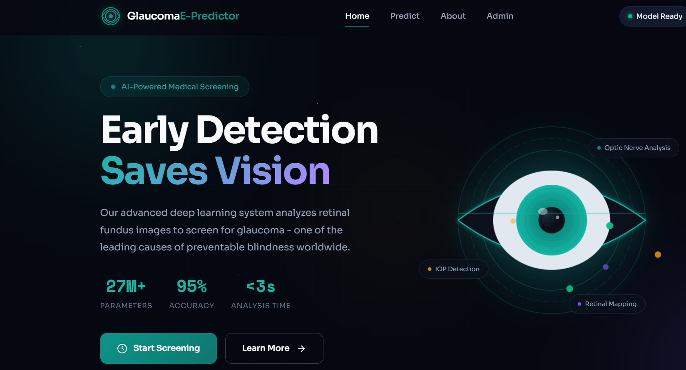
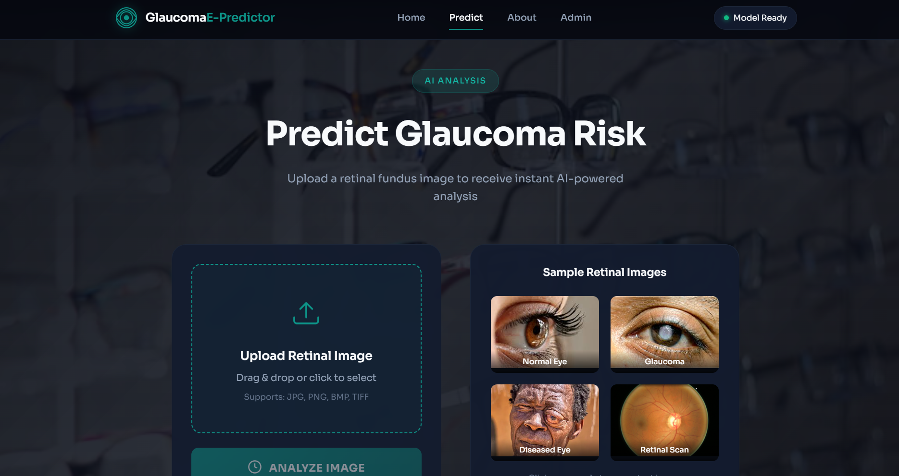

# Glaucoma E-Predictor

An AI-powered web application for early glaucoma screening from retinal fundus images. This full-stack machine learning system combines a deep learning CNN model with a modern web interface for instant predictions and continuous model improvement.

   

## Screenshots

### Homepage


### How It Works


### Prediction Interface


## Features

- **Real-time Prediction**: Upload retinal images and receive instant glaucoma risk assessments
- **Deep Learning Model**: Custom CNN architecture trained on medical imaging data
- **Risk Assessment**: Three-tier risk classification (Low, Moderate, High) with confidence scores
- **Model Retraining**: Built-in pipeline for continuous model improvement with new data
- **Modern UI**: Clean, responsive dashboard with visual risk gauges and detailed results
- **Secure Configuration**: Environment-based settings with hidden API endpoints

## Architecture

```
glaucoma-e-predictor/
├── backend/
│   ├── main.py              # FastAPI application & endpoints
│   ├── model.py             # CNN model architecture & training
│   ├── preprocessing.py     # Image preprocessing utilities
│   ├── config.py            # Configuration settings
│   └── requirements.txt     # Python dependencies
├── frontend/
│   ├── index.html           # Main dashboard interface
│   ├── styles.css           # Modern styling
│   ├── app.js               # Client-side logic
│   ├── config.js            # API configuration (gitignored)
│   └── images/              # Application images
├── models/                  # Saved model files
├── data/                    # Training dataset
├── scripts/
│   └── download_dataset.py  # Dataset download utility
└── README.md
```

## Quick Start

### Prerequisites

- Python 3.9 or higher
- pip package manager
- Kaggle account (for dataset download)

### 1. Clone & Setup

```bash
# Clone the repository
git clone https://github.com/yourusername/glaucoma-e-predictor.git
cd glaucoma-e-predictor

# Create virtual environment
python -m venv venv

# Activate virtual environment
# Windows:
venv\Scripts\activate
# Linux/Mac:
source venv/bin/activate

# Install dependencies
pip install -r backend/requirements.txt
```

### 2. Download Dataset

```bash
# Configure Kaggle credentials first (see Kaggle Setup below)
python scripts/download_dataset.py
```

### 3. Start the Backend

```bash
cd backend
python main.py
```

The API will be available at `http://localhost:8000`

### 4. Open the Frontend

Open `frontend/index.html` in your web browser, or serve it with a local server:

```bash
# Using Python's built-in server
cd frontend
python -m http.server 3000
```

Then visit `http://localhost:3000`

## API Endpoints

| Endpoint | Method | Description |
|----------|--------|-------------|
| `/` | GET | Health check |
| `/health` | GET | API health status |
| `/predict` | POST | Upload image for prediction |
| `/retrain` | POST | Start model retraining |
| `/training-status` | GET | Get current training status |
| `/model-info` | GET | Get model information |
| `/data-status` | GET | Check training data availability |
| `/initialize-model` | POST | Initialize/reinitialize model |

### Example: Making a Prediction

```python
import requests

url = "http://localhost:8000/predict"
files = {"file": open("retinal_image.jpg", "rb")}
response = requests.post(url, files=files)
result = response.json()

print(f"Prediction: {result['prediction']}")
print(f"Risk Level: {result['risk_level']}")
print(f"Probability: {result['percentage']}%")
```

## Configuration

### Environment Variables

Create a `.env` file in the `backend/` directory:

```env
# Model Configuration
MODEL_PATH=models/glaucoma_model.keras
BATCH_SIZE=32
EPOCHS=20
LEARNING_RATE=0.0001
VALIDATION_SPLIT=0.2

# Data Configuration
DATA_DIR=data

# API Configuration
API_HOST=0.0.0.0
API_PORT=8000
CORS_ORIGINS=*
```

### Frontend Configuration

Edit `frontend/config.js` to configure the API URL:

```javascript
window.API_CONFIG = {
    BASE_URL: 'http://localhost:8000',
    VERSION: '1.0.0'
};
```

## Kaggle Setup

1. Create a Kaggle account at [kaggle.com](https://www.kaggle.com)
2. Go to Account Settings > API > Create New Token
3. Place the downloaded `kaggle.json` in:
   - Windows: `C:\Users\<Username>\.kaggle\kaggle.json`
   - Linux/Mac: `~/.kaggle/kaggle.json`

## Model Architecture

The CNN architecture is optimized for retinal image analysis:

- **Input**: 224x224x3 RGB images
- **Architecture**: 4 convolutional blocks with batch normalization
- **Regularization**: Dropout layers (0.25-0.5)
- **Output**: Sigmoid activation for binary classification
- **Optimizer**: Adam with learning rate scheduling
- **Metrics**: Accuracy, AUC, Precision, Recall

## Training

### Through the UI

1. Navigate to the Admin section in the dashboard
2. Ensure training data is available
3. Set the number of epochs
4. Click "Start Retraining"
5. Monitor progress in real-time

### Through the API

```bash
curl -X POST "http://localhost:8000/retrain?epochs=20"
```

### Training Progress

```bash
curl "http://localhost:8000/training-status"
```

## Medical Disclaimer

**This tool is for educational and screening purposes only.** It should not be used as a substitute for professional medical diagnosis. Always consult with a qualified ophthalmologist for definitive glaucoma diagnosis and treatment.

Glaucoma is one of the leading causes of preventable blindness worldwide. Early detection through regular eye examinations is crucial for preventing vision loss.

## Security

- API configuration files are gitignored
- Environment variables for sensitive settings
- CORS configuration for controlled access
- Input validation on all endpoints

## Development

### Running Tests

```bash
cd backend
python -m pytest tests/
```

### Code Formatting

```bash
# Format Python code
black backend/

# Lint
flake8 backend/
```

## Deployment

### Docker

```dockerfile
FROM python:3.9-slim

WORKDIR /app
COPY backend/ ./backend/
COPY models/ ./models/

RUN pip install -r backend/requirements.txt

EXPOSE 8000
CMD ["python", "backend/main.py"]
```

### Cloud Platforms

- **Backend**: Deploy to Render, Railway, or AWS Lambda
- **Frontend**: Deploy to Vercel, Netlify, or GitHub Pages
- **Model**: Store on S3 or cloud storage for production

## Acknowledgments

- Dataset: [Glaucoma Detection Dataset](https://www.kaggle.com/datasets/sshikamaru/glaucoma-detection) on Kaggle
- TensorFlow/Keras for deep learning framework
- FastAPI for the modern Python web framework

## License

This project is licensed under the MIT License - see the [LICENSE](LICENSE) file for details.

---

Built for early glaucoma detection and prevention
